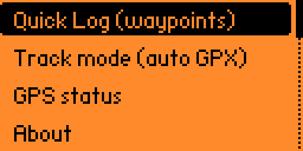
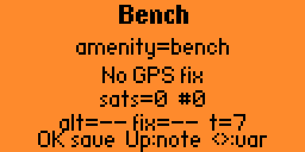
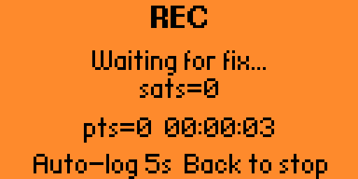
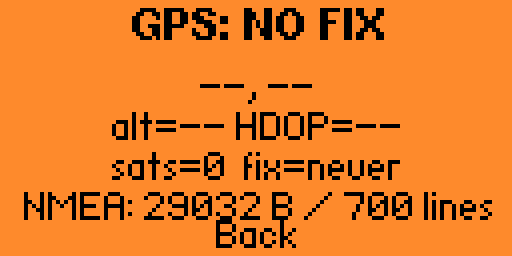

# flipperzero-osm-logger-gps

> Log **OSM POIs** in the field with a **Flipper Zero** + **NEO-6M GPS** :
> pick a POI type (bench, bin, drinking water, defibrillator…), save lat/lon/alt/timestamp/OSM tag
> to microSD in **5 native formats** (JSONL, CSV, GPX, GeoJSON, GPX track).


---

## ✨ Features

- **NMEA 0183** GPS reader (RMC + GGA) over UART, configurable baud rate (4800 / 9600 / 19200 / 38400 / 57600 / 115200)
- Auto-notification (vibration + green LED) when GPS fix is acquired
- **Battery badge** displayed on every live screen
- **GPS Status** screen: fix, lat/lon, altitude, HDOP, satellites, fix age, live NMEA RX counters
- **Settings menu** with persisted prefs on SD: baud rate, track interval, track min distance filter, track HDOP strict toggle, preview-before-save toggle, auto photo ID, duplicate detection threshold
- **Duplicate detection**: when saving, if a point with the same tag exists within X meters, a confirmation screen appears ("Same tag Ym away — OK=save anyway, Back=cancel"). Threshold configurable (off / 5 / 10 / 25 m).
- **Clear save-error screens** when the SD is absent / full / unwritable.
- **Quick Log (waypoints)** mode:
  - Submenu of **23 OSM presets** by default, grouped by category (street furniture, roads, shops, emergency…)
  - **SD-loadable presets**: drop a `presets.txt` on the SD to replace the built-in list without recompiling
  - **Preset variants** cyclable with `←` / `→` — alternative values *or* additional secondary tags (e.g. `Bench` → `amenity=bench` → `amenity=bench;material=wood`)
  - **Short note editor** via `Up` (Flipper TextInput), `Down` to clear
  - Live screen: coords, altitude, HDOP, sats, fix age, session + cumulative counters
  - **Short `OK`**: save if `fix OK` and `HDOP ≤ 2.5`, error tone otherwise (or preview screen if enabled)
  - **Long `OK`**: force save regardless of fix quality, bypasses preview
- **Track mode (auto GPX log)**:
  - `<trkpt>` written every N seconds while the view is active and a fix is available
  - Distance filter: skips points that didn't move far enough (configurable threshold)
  - Heading / course over ground displayed live
  - Each session starts a new `<trkseg>` (no bogus line between separate sessions)
  - Ideal for mapping a street or path on foot or bike
- **Last points browser** (main menu entry): scrollable list of the 10 most recent saves. Tap any point to see full details (time, coords, altitude, HDOP, sats, tag, note). Actions: **Delete last** (undo across all 4 output files) and **Clear all** (new session).
- Saves to `/ext/apps_data/osm_logger/` in **5 native formats** (all valid at all times):
  - `points.jsonl` — one JSON line per point
  - `notes.csv` — spreadsheet-friendly
  - `points.gpx` — GPX 1.1 waypoints, direct import into JOSM / iD
  - `points.geojson` — FeatureCollection, direct import into QGIS / geojson.io
  - `track.gpx` — GPX `<trkseg>` track, import into any GPX viewer
- Works on **stock and Momentum firmware** (the app auto-disables the Expansion service to free the UART)

---

## 🧩 Hardware

- **Flipper Zero** (with microSD)
- **NEO-6M V2 GPS** (u-blox NEO-6) — NMEA output at 9600 bauds
- Ceramic antenna (bundled) or external active antenna

### Wiring (3.3 V, 3 wires)

```
  Flipper Zero GPIO                          NEO-6M GPS
 ┌────┬──────────┐                          ┌──────────┐
 │  9 │ 3V3      ├──────── 🔴 red ────────▶ │ VCC      │
 │ 10 │ SWC      │                          │          │
 │ 11 │ GND      ├──────── ⚫ black ──────▶ │ GND      │
 │ 12 │ SIO      │                          │          │
 │ 13 │ TX       │                          │ RX ◁ ── unused (no command sent)
 │ 14 │ RX       │◀─────── 🟢 green ─────── │ TX       │
 │ 15 │ C1       │                          └──────────┘
 │ 16 │ C0       │
 │ 17 │ 1W       │
 │ 18 │ GND      │
 └────┴──────────┘
```

Only **3 wires** are needed because the app only *reads* NMEA frames from the GPS — never sends commands back.

**⚠️ Use 3.3 V — never 5 V.** See [docs/HARDWARE.md](docs/HARDWARE.md) for details, first-fix tips and troubleshooting.

---

## 🔧 Build & install

This app uses **`ufbt`** (micro Flipper Build Tool) — the official tool for external apps. Python 3.8+ required.

```bash
# 1. Install ufbt
python3 -m pip install --upgrade ufbt    # macOS / Linux
py -m pip install --upgrade ufbt         # Windows

# 2. Clone and build
git clone https://github.com/simongrossi/flipperzero-osm-logger-gps
cd flipperzero-osm-logger-gps
ufbt                    # produces ./dist/osm_logger.fap

# 3. Deploy (Flipper plugged via USB, qFlipper closed)
ufbt launch             # uploads + starts the app
```

> 💡 If `ufbt: command not found`, add `$HOME/Library/Python/3.9/bin` (macOS) or the equivalent to your `PATH`.

Alternatively, drop `dist/osm_logger.fap` into `/ext/apps/GPIO/` via qFlipper.

---

## ▶️ Usage

1. Launch **OSM Logger** from the Apps menu.
2. Main menu → `Quick Log (waypoints)`.
3. Pick a preset (Bench, Pharmacy, Defibrillator, …).
4. **Quick Log screen** — wait for a fix (`fix=Xs` shows the age of the last fix).

| Key         | Action                                                       |
|-------------|--------------------------------------------------------------|
| `OK` short  | Save if `fix OK` and `HDOP ≤ 2.5` (error tone otherwise)     |
| `OK` long   | Force save despite missing fix or high HDOP                  |
| `←` / `→`   | Cycle through variants (if the preset has multiple values)   |
| `Up`        | Open the note editor (Flipper TextInput)                     |
| `Down`      | Clear the current note                                       |
| `Back`      | Back to the preset list                                      |

5. At the end of a session, grab the files via qFlipper (File Manager) or USB mass storage:
   - `/ext/apps_data/osm_logger/points.jsonl`
   - `/ext/apps_data/osm_logger/notes.csv`
   - `/ext/apps_data/osm_logger/points.gpx`
   - `/ext/apps_data/osm_logger/points.geojson`
   - `/ext/apps_data/osm_logger/track.gpx`

The main menu also has `GPS status` (dedicated diagnostic view) and `About`.

### Quick Log screen at a glance

```
     < Cafe 2/4 >           <- preset + current variant (if >1)
     amenity=pub            <- effective OSM tag
    48.43123, -0.09321      <- live coords
    HDOP=1.3 sats=9  #12    <- fix quality + session counter
    alt=45m fix=3s  t=247   <- altitude, fix age, total in file
  OK save  Up:note  <>:var  <- key hints (or "note: ..." when set)
```

---

## 📷 Screenshots

| Main menu | Preset picker | Quick Log |
|-----------|---------------|-----------|
|  |  |  |

| Track mode | GPS status |
|------------|------------|
|  |  |

## 📚 Documentation

- **[docs/HARDWARE.md](docs/HARDWARE.md)** — supported GPS modules, wiring, first fix, troubleshooting
- **[docs/FORMATS.md](docs/FORMATS.md)** — detailed spec of the 5 output formats, field by field
- **[docs/DEVELOPMENT.md](docs/DEVELOPMENT.md)** — code structure, adding a preset, adding a view, debugging, known pitfalls
- **[docs/ROADMAP.md](docs/ROADMAP.md)** — planned features (not yet implemented) with implementation hints
- **[docs/GETTING_STARTED_OSM.md](docs/GETTING_STARTED_OSM.md)** — beginner-friendly OSM contributor guide (zero to first upload)
- **[src/presets.c](src/presets.c)** — the 23 default presets (editable by rebuilding, or override via `presets.txt` on SD)
- **[presets.txt.sample](presets.txt.sample)** — sample presets file (in French, shows the syntax)

---

## 🗺️ OSM workflow

- **JOSM / iD**: import `points.gpx` directly (waypoints named with their OSM tag).
- **QGIS / geojson.io**: import `points.geojson` directly.
- **OSM Notes**: `notes.csv` is a text base you can post manually.
- **GPX track**: import `track.gpx` into JOSM, GPX Viewer or Gaia GPS to visualise your route.
- **Alternative**: `python3 scripts/jsonl_to_geojson.py points.jsonl > points.geojson` if you prefer to start from JSONL.

---

## 🚧 Roadmap

See **[docs/ROADMAP.md](docs/ROADMAP.md)** for the full list of planned features with implementation hints.

Short summary:
- Preset variants as additional tags (not just alternative values)
- Sub-categories in the preset menu
- Distance filter in track mode (skip points that didn't move)
- Persistent notes across sessions
- Persistent notes across sessions
- Support for other GPS modules (PA1010D, BN-180, etc.)

---

## 🖊️ License

MIT — see [LICENSE](LICENSE).
